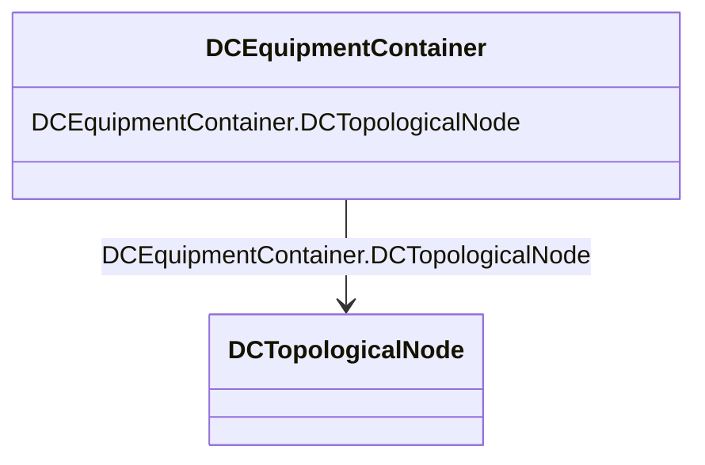

# DCEquipmentContainer

_A modelling construct to provide a root class for containment of DC as well as AC equipment. The class differ from the EquipmentContaner for AC in that it may also contain DCNode-s. Hence it can contain both AC and DC equipment._

**URI**: [cim:DCEquipmentContainer](http://iec.ch/TC57/CIM100#DCEquipmentContainer) 
**Type**: Class

<!-- no inheritance hierarchy -->

## Attributes

| Name | URI | Cardinality and Range | Description | Inheritance |
| ---  | --- | --- | --- | --- |
| DCTopologicalNode | [cim:DCEquipmentContainer.DCTopologicalNode](http://iec.ch/TC57/CIM100#DCEquipmentContainer.DCTopologicalNode) | *    [DCTopologicalNode](DCTopologicalNode.md)  | The topological nodes which belong to this connectivity node container | direct |

## Usages

| used by | used in | type | used |
| ---  | --- | --- | --- |
| [DCTopologicalNode](DCTopologicalNode.md) | DCEquipmentContainer | range | [DCEquipmentContainer](DCEquipmentContainer.md) |

## Identifier and Mapping Information

### Schema Source

* from schema: http://iec.ch/TC57/ns/CIM/Topology-EU#Package_TopologyProfile

## Mappings

| Mapping Type | Mapped Value |
| ---  | ---  |
| self | cim:DCEquipmentContainer |
| native | this:DCEquipmentContainer |

