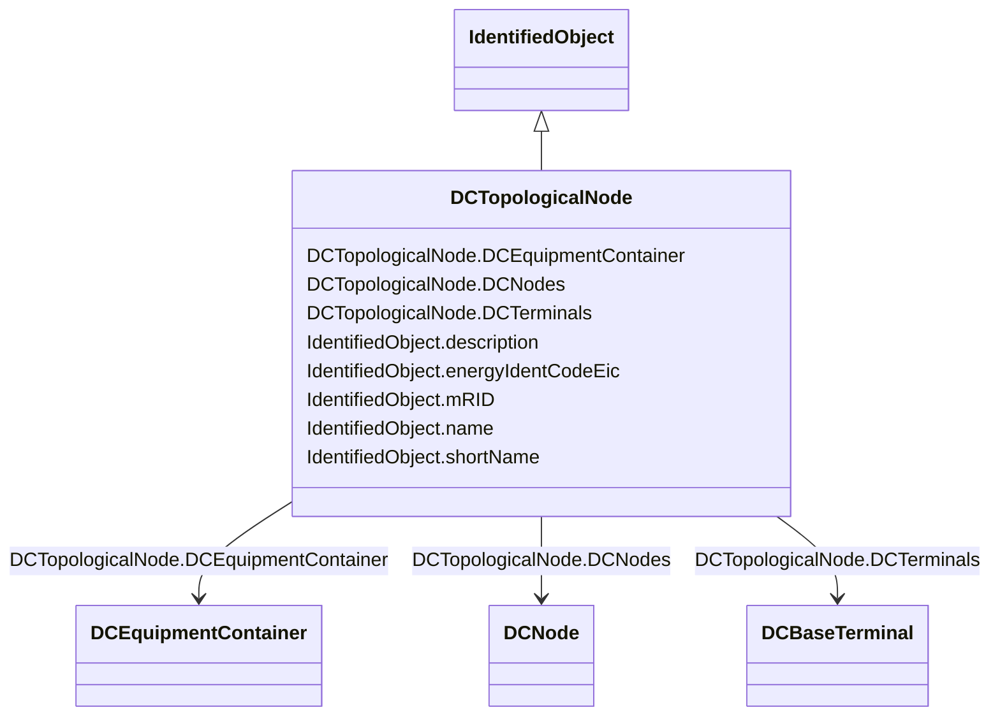

# DCTopologicalNode

_DC bus._

**URI**: [cim:DCTopologicalNode](http://iec.ch/TC57/CIM100#DCTopologicalNode) 
**Type**: Class

## Inheritance
* [IdentifiedObject](IdentifiedObject.md)
    * **DCTopologicalNode**

## Attributes

| Name | URI | Cardinality and Range | Description | Inheritance |
| ---  | --- | --- | --- | --- |
| DCTerminals | [cim:DCTopologicalNode.DCTerminals](http://iec.ch/TC57/CIM100#DCTopologicalNode.DCTerminals) | 0..*    [DCBaseTerminal](DCBaseTerminal.md)  | See association end TopologicalNode | direct |
| DCEquipmentContainer | [cim:DCTopologicalNode.DCEquipmentContainer](http://iec.ch/TC57/CIM100#DCTopologicalNode.DCEquipmentContainer) | 1..1    [DCEquipmentContainer](DCEquipmentContainer.md)  | The connectivity node container to which the topological node belongs | direct |
| DCNodes | [cim:DCTopologicalNode.DCNodes](http://iec.ch/TC57/CIM100#DCTopologicalNode.DCNodes) | 0..*    [DCNode](DCNode.md)  | The DC connectivity nodes combined together to form this DC topological node | direct |
| description | [cim:IdentifiedObject.description](http://iec.ch/TC57/CIM100#IdentifiedObject.description) | 0..1    string  | The description is a free human readable text describing or naming the object | [IdentifiedObject](IdentifiedObject.md) |
| energyIdentCodeEic | [eu:IdentifiedObject.energyIdentCodeEic](http://iec.ch/TC57/CIM100-European#IdentifiedObject.energyIdentCodeEic) | 0..1    string  | The attribute is used for an exchange of the EIC code (Energy identification ... | [IdentifiedObject](IdentifiedObject.md) |
| mRID | [cim:IdentifiedObject.mRID](http://iec.ch/TC57/CIM100#IdentifiedObject.mRID) | 1..1    string  | Master resource identifier issued by a model authority | [IdentifiedObject](IdentifiedObject.md) |
| name | [cim:IdentifiedObject.name](http://iec.ch/TC57/CIM100#IdentifiedObject.name) | 0..1    string  | The name is any free human readable and possibly non unique text naming the o... | [IdentifiedObject](IdentifiedObject.md) |
| shortName | [eu:IdentifiedObject.shortName](http://iec.ch/TC57/CIM100-European#IdentifiedObject.shortName) | 0..1    string  | The attribute is used for an exchange of a human readable short name with len... | [IdentifiedObject](IdentifiedObject.md) |

## Usages

| used by | used in | type | used |
| ---  | --- | --- | --- |
| [ACDCConverterDCTerminal](ACDCConverterDCTerminal.md) | DCTopologicalNode | range | [DCTopologicalNode](DCTopologicalNode.md) |
| [DCBaseTerminal](DCBaseTerminal.md) | DCTopologicalNode | range | [DCTopologicalNode](DCTopologicalNode.md) |
| [DCEquipmentContainer](DCEquipmentContainer.md) | DCTopologicalNode | range | [DCTopologicalNode](DCTopologicalNode.md) |
| [DCNode](DCNode.md) | DCTopologicalNode | range | [DCTopologicalNode](DCTopologicalNode.md) |
| [DCTerminal](DCTerminal.md) | DCTopologicalNode | range | [DCTopologicalNode](DCTopologicalNode.md) |

## Identifier and Mapping Information

### Schema Source

* from schema: http://iec.ch/TC57/ns/CIM/Topology-EU#Package_TopologyProfile

## Mappings

| Mapping Type | Mapped Value |
| ---  | ---  |
| self | cim:DCTopologicalNode |
| native | this:DCTopologicalNode |

