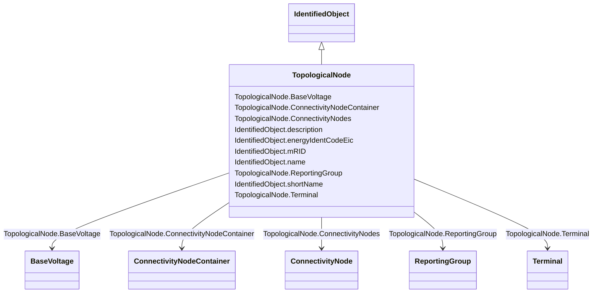

# TopologicalNode

_For a detailed substation model a topological node is a set of connectivity nodes that, in the current network state, are connected together through any type of closed switches, including  jumpers. Topological nodes change as the current network state changes (i.e., switches, breakers, etc. change state)._

_For a planning model, switch statuses are not used to form topological nodes. Instead they are manually created or deleted in a model builder tool. Topological nodes maintained this way are also called "busses"._

**URI**: [cim:TopologicalNode](http://iec.ch/TC57/CIM100#TopologicalNode) 
**Type**: Class

## Inheritance
* [IdentifiedObject](IdentifiedObject.md)
    * **TopologicalNode**

## Attributes

| Name | URI | Cardinality and Range | Description | Inheritance |
| ---  | --- | --- | --- | --- |
| BaseVoltage | [cim:TopologicalNode.BaseVoltage](http://iec.ch/TC57/CIM100#TopologicalNode.BaseVoltage) | 1    [BaseVoltage](BaseVoltage.md)  | The base voltage of the topological node | direct |
| ConnectivityNodes | [cim:TopologicalNode.ConnectivityNodes](http://iec.ch/TC57/CIM100#TopologicalNode.ConnectivityNodes) | *    [ConnectivityNode](ConnectivityNode.md)  | The connectivity nodes combine together to form this topological node | direct |
| ConnectivityNodeContainer | [cim:TopologicalNode.ConnectivityNodeContainer](http://iec.ch/TC57/CIM100#TopologicalNode.ConnectivityNodeContainer) | 1    [ConnectivityNodeContainer](ConnectivityNodeContainer.md)  | The connectivity node container to which the topological node belongs | direct |
| Terminal | [cim:TopologicalNode.Terminal](http://iec.ch/TC57/CIM100#TopologicalNode.Terminal) | 1..*    [Terminal](Terminal.md)  | The terminals associated with the topological node | direct |
| ReportingGroup | [cim:TopologicalNode.ReportingGroup](http://iec.ch/TC57/CIM100#TopologicalNode.ReportingGroup) | 0..1    [ReportingGroup](ReportingGroup.md)  | The reporting group to which the topological node belongs | direct |
| description | [cim:IdentifiedObject.description](http://iec.ch/TC57/CIM100#IdentifiedObject.description) | 0..1    string  | The description is a free human readable text describing or naming the object | [IdentifiedObject](IdentifiedObject.md) |
| energyIdentCodeEic | [eu:IdentifiedObject.energyIdentCodeEic](http://iec.ch/TC57/CIM100-European#IdentifiedObject.energyIdentCodeEic) | 0..1    string  | The attribute is used for an exchange of the EIC code (Energy identification ... | [IdentifiedObject](IdentifiedObject.md) |
| mRID | [cim:IdentifiedObject.mRID](http://iec.ch/TC57/CIM100#IdentifiedObject.mRID) | 1    string  | Master resource identifier issued by a model authority | [IdentifiedObject](IdentifiedObject.md) |
| name | [cim:IdentifiedObject.name](http://iec.ch/TC57/CIM100#IdentifiedObject.name) | 0..1    string  | The name is any free human readable and possibly non unique text naming the o... | [IdentifiedObject](IdentifiedObject.md) |
| shortName | [eu:IdentifiedObject.shortName](http://iec.ch/TC57/CIM100-European#IdentifiedObject.shortName) | 0..1    string  | The attribute is used for an exchange of a human readable short name with len... | [IdentifiedObject](IdentifiedObject.md) |

## Usages

| used by | used in | type | used |
| ---  | --- | --- | --- |
| [BaseVoltage](BaseVoltage.md) | TopologicalNode | range | [TopologicalNode](TopologicalNode.md) |
| [ConnectivityNode](ConnectivityNode.md) | TopologicalNode | range | [TopologicalNode](TopologicalNode.md) |
| [ConnectivityNodeContainer](ConnectivityNodeContainer.md) | TopologicalNode | range | [TopologicalNode](TopologicalNode.md) |
| [Terminal](Terminal.md) | TopologicalNode | range | [TopologicalNode](TopologicalNode.md) |
| [ReportingGroup](ReportingGroup.md) | TopologicalNode | range | [TopologicalNode](TopologicalNode.md) |

## Identifier and Mapping Information

### Schema Source

* from schema: http://iec.ch/TC57/ns/CIM/Topology-EU#Package_TopologyProfile

## Mappings

| Mapping Type | Mapped Value |
| ---  | ---  |
| self | cim:TopologicalNode |
| native | this:TopologicalNode |

