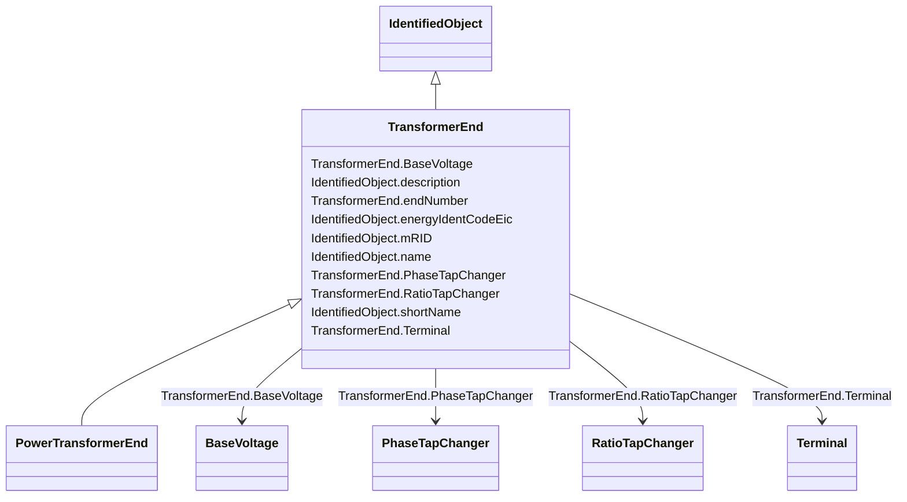

# TransformerEnd

_A conducting connection point of a power transformer. It corresponds to a physical transformer winding terminal.  In earlier CIM versions, the TransformerWinding class served a similar purpose, but this class is more flexible because it associates to terminal but is not a specialization of ConductingEquipment._

**URI**: [cim:TransformerEnd](http://iec.ch/TC57/CIM100#TransformerEnd) 
**Type**: Class

## Inheritance
* [IdentifiedObject](IdentifiedObject.md)
    * **TransformerEnd**
        * [PowerTransformerEnd](PowerTransformerEnd.md)

## Attributes

| Name | URI | Cardinality and Range | Description | Inheritance |
| ---  | --- | --- | --- | --- |
| BaseVoltage | [cim:TransformerEnd.BaseVoltage](http://iec.ch/TC57/CIM100#TransformerEnd.BaseVoltage) | 1..1    [BaseVoltage](BaseVoltage.md)  | Base voltage of the transformer end | direct |
| PhaseTapChanger | [cim:TransformerEnd.PhaseTapChanger](http://iec.ch/TC57/CIM100#TransformerEnd.PhaseTapChanger) | 0..1    [PhaseTapChanger](PhaseTapChanger.md)  | Phase tap changer associated with this transformer end | direct |
| RatioTapChanger | [cim:TransformerEnd.RatioTapChanger](http://iec.ch/TC57/CIM100#TransformerEnd.RatioTapChanger) | 0..1    [RatioTapChanger](RatioTapChanger.md)  | Ratio tap changer associated with this transformer end | direct |
| Terminal | [cim:TransformerEnd.Terminal](http://iec.ch/TC57/CIM100#TransformerEnd.Terminal) | 1..1    [Terminal](Terminal.md)  | Terminal of the power transformer to which this transformer end belongs | direct |
| endNumber | [cim:TransformerEnd.endNumber](http://iec.ch/TC57/CIM100#TransformerEnd.endNumber) | 1..1    integer  | Number for this transformer end, corresponding to the end's order in the powe... | direct |
| description | [cim:IdentifiedObject.description](http://iec.ch/TC57/CIM100#IdentifiedObject.description) | 0..1    string  | The description is a free human readable text describing or naming the object | [IdentifiedObject](IdentifiedObject.md) |
| energyIdentCodeEic | [eu:IdentifiedObject.energyIdentCodeEic](http://iec.ch/TC57/CIM100-European#IdentifiedObject.energyIdentCodeEic) | 0..1    string  | The attribute is used for an exchange of the EIC code (Energy identification ... | [IdentifiedObject](IdentifiedObject.md) |
| mRID | [cim:IdentifiedObject.mRID](http://iec.ch/TC57/CIM100#IdentifiedObject.mRID) | 1..1    string  | Master resource identifier issued by a model authority | [IdentifiedObject](IdentifiedObject.md) |
| name | [cim:IdentifiedObject.name](http://iec.ch/TC57/CIM100#IdentifiedObject.name) | 1..1    string  | The name is any free human readable and possibly non unique text naming the o... | [IdentifiedObject](IdentifiedObject.md) |
| shortName | [eu:IdentifiedObject.shortName](http://iec.ch/TC57/CIM100-European#IdentifiedObject.shortName) | 0..1    string  | The attribute is used for an exchange of a human readable short name with len... | [IdentifiedObject](IdentifiedObject.md) |

## Usages

| used by | used in | type | used |
| ---  | --- | --- | --- |
| [BaseVoltage](BaseVoltage.md) | TransformerEnds | range | [TransformerEnd](TransformerEnd.md) |
| [PhaseTapChanger](PhaseTapChanger.md) | TransformerEnd | range | [TransformerEnd](TransformerEnd.md) |
| [PhaseTapChangerAsymmetrical](PhaseTapChangerAsymmetrical.md) | TransformerEnd | range | [TransformerEnd](TransformerEnd.md) |
| [PhaseTapChangerLinear](PhaseTapChangerLinear.md) | TransformerEnd | range | [TransformerEnd](TransformerEnd.md) |
| [PhaseTapChangerNonLinear](PhaseTapChangerNonLinear.md) | TransformerEnd | range | [TransformerEnd](TransformerEnd.md) |
| [PhaseTapChangerSymmetrical](PhaseTapChangerSymmetrical.md) | TransformerEnd | range | [TransformerEnd](TransformerEnd.md) |
| [PhaseTapChangerTabular](PhaseTapChangerTabular.md) | TransformerEnd | range | [TransformerEnd](TransformerEnd.md) |
| [RatioTapChanger](RatioTapChanger.md) | TransformerEnd | range | [TransformerEnd](TransformerEnd.md) |
| [Terminal](Terminal.md) | TransformerEnd | range | [TransformerEnd](TransformerEnd.md) |

## Identifier and Mapping Information

### Schema Source

* from schema: http://iec.ch/TC57/ns/CIM/CoreEquipment-EU#Package_CoreEquipmentProfile

## Mappings

| Mapping Type | Mapped Value |
| ---  | ---  |
| self | cim:TransformerEnd |
| native | this:TransformerEnd |

