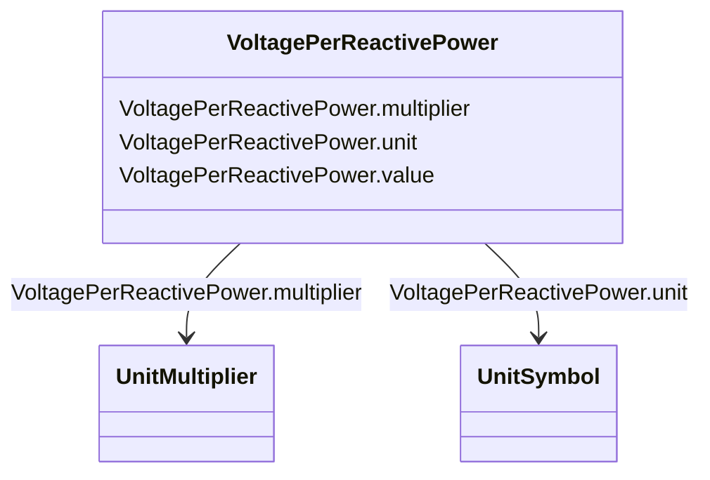

# VoltagePerReactivePower

_Voltage variation with reactive power._

**URI**: [cim:VoltagePerReactivePower](http://iec.ch/TC57/CIM100#VoltagePerReactivePower) 
**Type**: Class

<!-- no inheritance hierarchy -->

## Attributes

| Name | URI | Cardinality and Range | Description | Inheritance |
| ---  | --- | --- | --- | --- |
| value | [cim:VoltagePerReactivePower.value](http://iec.ch/TC57/CIM100#VoltagePerReactivePower.value) | 0..1    float  |  | direct |
| unit | [cim:VoltagePerReactivePower.unit](http://iec.ch/TC57/CIM100#VoltagePerReactivePower.unit) | 0..1    [UnitSymbol](UnitSymbol.md)  |  | direct |
| multiplier | [cim:VoltagePerReactivePower.multiplier](http://iec.ch/TC57/CIM100#VoltagePerReactivePower.multiplier) | 0..1    [UnitMultiplier](UnitMultiplier.md)  |  | direct |

## Usages

| used by | used in | type | used |
| ---  | --- | --- | --- |
| [LinearShuntCompensator](LinearShuntCompensator.md) | voltageSensitivity | range | [VoltagePerReactivePower](VoltagePerReactivePower.md) |
| [NonlinearShuntCompensator](NonlinearShuntCompensator.md) | voltageSensitivity | range | [VoltagePerReactivePower](VoltagePerReactivePower.md) |
| [ShuntCompensator](ShuntCompensator.md) | voltageSensitivity | range | [VoltagePerReactivePower](VoltagePerReactivePower.md) |
| [StaticVarCompensator](StaticVarCompensator.md) | slope | range | [VoltagePerReactivePower](VoltagePerReactivePower.md) |

## Identifier and Mapping Information

### Schema Source

* from schema: http://iec.ch/TC57/ns/CIM/CoreEquipment-EU#Package_CoreEquipmentProfile

## Mappings

| Mapping Type | Mapped Value |
| ---  | ---  |
| self | cim:VoltagePerReactivePower |
| native | this:VoltagePerReactivePower |

